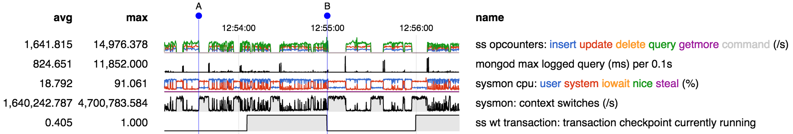
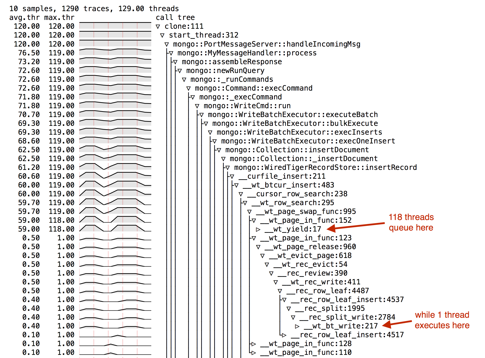
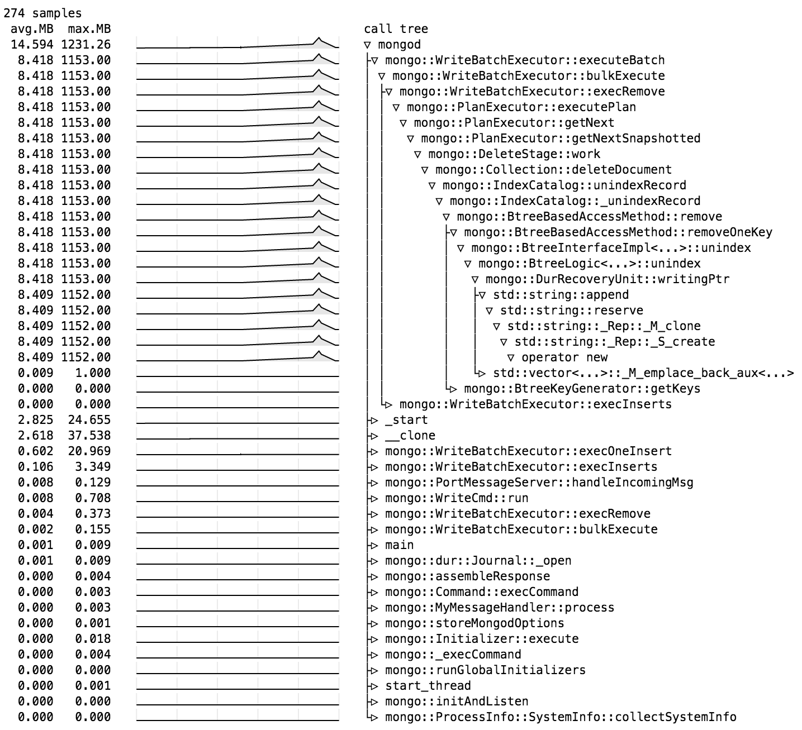

## Timeseries Visualization Tools

This project provides some tooling around visualizing timeseries data
from MongoDB installations. The goal is to visualize a large number of
different metrics from all layers of the system using "sparkline"
graphs in a way that allows easy and accurate correlation of behaviors
at all layers of the system.

For example, in the following visualization we combine information
from the opcounters in serverStatus (first row), long queries logged
by mongod (second row), CPU utilization information (third and fourth
rows), and WT checkpoint information (last row):

From this we conclude that the performance problem involving "pauses",
for example at times A and B, is associated with high system CPU and
context switch rates, and seems more likely to occur following a WT
checkpoint.

In addition a couple of tools are provided for collecting timeseries
data that supplement the wide range of tools already available for
that purpose.

The visualization tooling is built around a generic framework that
parses four different classes of files, and currently has descriptors
for parsing a number of specific types of each class, as
follows. Adding descriptors for each new type is relatively easy.

* json files

    * serverStatus() time series, providing generic system metrics as
      well as metrics specific to each storage engine (such as WT)

    * collection.stats() time series, providing metrics for a specific
      namespace (including WT-specific metrics).

    * oplog, providing visualization of activity in each namespace over
      time.

* csv files

    * basic generic visualization of any timeseries csv file
      with a header line

    * sysmon (iostat-like program included as part of
      this project that collects cpu and disk utilization data but with
      higher time resolution, more data, more readily parsed output than
      iostat).

* text files parsed with regexps

    * iostat output, including cpu, disk utilization

    * wt stats log, which provides an alternative means of obtaining
      the same data as the WT-specific section of serverStatus()

    * mongod log files

    * can be easily configured to parse any file with timestamps and
      data, such as customer log files, on an ad-hoc basis.

* periodic stack trace samples collected by gdbmon or quickmon (both
  provided as part of this project). Visualizes call tree with time
  series data showing number of threads at each call site over time to
  allow correl ating program activity with other system, mongod, and
  app behavior.

## Using the Timeseries Visualization Tool

Here's a simple example to get started. Collect some data as follows:

    delay=1 # pick a number in seconds
    mongo --eval "while(true) {print(JSON.stringify(db.serverStatus({tcmalloc:true}))); sleep(1000*$delay)}" >ss.log &
    iostat -k -t -x $delay >iostat.log &

When you have collected as much data as desired, terminate the data collection processes, for example

    killall mongo iostat

Install timeseries.py pre-reqs:

    sudo pip install -r requirements.txt

Then visualize the results as follows:

    python timeseries.py ss:ss.log iostat:iostat.log mongod:mongod.log >timeseries.html
    open timeseries.html

This will select
* all metrics whose name begins with "ss" (which stands for serverStatus) from ss.log, because by convention all metrics found in a serverStatus log have names that begin with ss; and
* all metrics whose name begins with "iostat" from iostat.log, and
* all metrics whose name begins with "mongod" from mongod.log.

The initial view will be restricted to the most important (level 1) statisics; you can interactively request more detailed metrics, as described in the help text included with the graphs.

### Recommended data collection for mongod performance issues

* **MongoDB logs.** Collect mongod logs as usual, and then visualize log file db.log by
  adding the following timeseries.py command line argument:

        mongod:db.log

  This will enable all metrics whose names start with "mongod" from
  the db.log file, including for example information about long
  queries.

* **Server stats.** While running the workload, collect a
  db.serverStatus() timeseries as follows, substituting an appropriate
  value for sampling interval $delay (in floating point seconds):

        mongo --eval "while(true) {print(JSON.stringify(db.serverStatus({tcmalloc:1}))); sleep($delay*1000)}" >ss.log &

  Then visualize the output ss.log as by adding the following
  timeseries.py command line argument:

        ss:ss.log

  This will enable all metrics whose names start with "ss" from the file
  ss.log. This includes information about operation rates, locking,
  queues, network utilization, storage entine internals, and so on.

* **Replica set status.** While running the workload, collect an
  rs.status() timeseries as follows, substituting an appropriate
  value for sampling interval $delay (in floating point seconds):

        mongo --eval "while(true) {print(JSON.stringify(rs.status())); sleep($delay*1000)}" >rs.log &

  Then visualize the output rs.log as by adding the following
  timeseries.py command line argument:

        rs:rs.log

  This will enable all metrics whose names start with "rs" from the file
  rs.log. This includes information about replica state and replica lag.

* **Collection stats.** If your investigation focuses around a
  particular collection, you can collect timeseries data for that
  collection as follows, substituting appropriate values for db $db,
  collection $c, and sampling interval $delay (in floating point
  seconds):

        mongo $db --eval "
            while(true) {
                s = db.$c.stats();
                s.time = new Date();
                print(JSON.stringify(s));
                sleep($delay*1000)
            }
        " >cs.log &

  Then visualize the output cs.log as by adding the following
  timeseries.py command line argument:

        cs:cs.log

  This will enable all metrics whose names start with "cs" from the
  file cs.log, which includes information such as size and operations
  related to the associated collection.

* **System stats.** For most performance investigations CPU and disk
  statistics are useful. You can use the sysmon.py tool from this
  project as follows, substituting an appropriate value for sampling
  interval $delay (in floating point seconds):

        python sysmon.py $delay >sysmon.log &

  Then visualize the output sysmon.log as by adding the following
  timeseries.py command line argument:

        sysmon:sysmon.log

  This will enable all metrics whose names start with "sysmon" from
  the file sysmon.log, which includes information such as CPU and disk
  utilization statistics.

* **Iostat.** While it has some disadvantages, it can be simpler to
  use iostat rather than the custom script sysmon.py. Be sure to
  include timestamps with the -t option, and use the -k option to
  ensure that data rates are given in kB/s:

        iostat -k -t -x $delay >iostat.log &

  Since iostat timestamps don't have a timezone, you will need to supply
  that when you visualize the data, for example using the following
  timeseries.py command-line argument if the timestamps are EDT:

        'iostat(tz=-4):iostat.log'

* **Stack trace samples.** For some deeper investigations tack trace
  sample can be useful for "advanced" analysis on in-house repros, and
  possibly for some customers on test systems, but is *not* suitable
  for use on customer production system because of the potential
  performance and functional impact on monogd. Stack trace samples can
  be collected using gdbmon.py in this project as follows,
  substituting an appropriate value for sampling interval $delay (in
  floating point seconds):

        python gdbmon.py $(pidof mongod) $delay >gdbmon.log &

  Then visualize the results using a separate tool found in this
  project; for example:

        python fold_gdb.py <gdbmon.log | \
            python calltree.py --graph-scale log >calltree.html
        open -a 'Google Chrome' calltree.html

  See [gdbmon](gdbmon.md) and [calltree](calltree.md) documentation for
  more information. *Important:* when using gdb profiling you should
  use a stripped binary because gdb stops the process for several
  seconds on each sample to obtain line numbers if the binary is not
  stripped.

  An alternative to gdbmon, quickmon, is also available. It is much
  faster than gdb at collecting the stack traces so it has less impact
  on the running process, but it requires that you compile mongod from
  source with the --no-omit-frame-pointer flags.  Details are provided
  in a [later section](#quickmon).

### About the browser

I use mostly Chrome, and have seen some issues on Safari. For now
please use Chrome to view the .html file if possible.

### Performance of the tool

Large data sets will 1) take a long time to process and 2) generate
html files that may overwhelm the browser. Working on improvements,
but for now to avoid this issue try specifying (for example) --every
300 on the command line to only look at log entries every 5 minutes,
to get an overview; and then select a region to view in more detail
and use --after and --before. NOTE: when you specify --every it will
simply ignore some of the input. For cumulative counters that is ok
because it in effect gives you an averaged view, but for events
(e.g. long queries in mongod, or checkpoints running in ss) it may
simply miss some events, so be careful when interpreting graphs
generated using --every.

### Timezones

The iostat output uses timestamps that don't include a timezone;
timeseries.py will assume the local timezone of the machine where
timeseries.py is installed. If this is different from the timezone of
the machine where iostats.log was collected, you will see that the
iostats don't line up with the other logs, so you will need to specify
the timezone in effect on the machine where iostats.log was
collected. For example, if that machine is on PST, specify:

    python timeseries.py "ss:ss.log" "iostat(tz=-8):iostat.log" "mongod:mongod.log" >timeseries.html
    open timeseries.html

### Selecting metrics from the command line

If you are doing the same groupings over and over, e.g. want to script
it, it becomes worthwhile to select just the stats you want on the
command line. The "ss:", "iostat:", and "mongod:" strings above are
actually just abbreviations that will match all metrics beginning with
"ss", "iostat", and "mongod". To make a more specific selection you
can say for example:

    python timeseries.py "iostat cpu:iostat.log"                        # shows all iostat cpu metrics
    python timeseries.py "iostat cpu user:iostat.log"                   # shows only user cpu time
    python timeseries.py "cpu user:iostat.log"                          # same as above - names are matched using a fuzzy algorithm
    python timeseries.py "cpu user:iostat.log" "cpu system:iostat.log"  # specify same file multiple times to select multiple groups

### Collecting system performance data on Windows

You can collect system performance data related to CPU, memory, and
disk on Windows using the built-in Windows logman command. First,
define up a data collector called "win-perf" as follows:

    logman create counter win-perf --v -si 1 -f csv -o c:\tmp\win-perf.csv -cf win-perf.txt

This uses a file [win-perf.txt](win-perf.txt), found in this project,
that lists an assortment of useful Windows performance counters
related to CPU, memory, and disk. The -si parameter controls the
sampling frequency; a frequency of 1 second is useful for most short-
to medium-length runs.  Output location is specified by the -o
parameter.

Then when you are ready to begin data collection, start, run your
workload, then stop the data collection as follows:

    logman start win-perf
    ...
    logman stop win-perf

You can visualize the resulting win-perf.csv file, together with any
other performance data you may have collected, such as serverStatus
time series, using the [timeseries tool](timeseries.py) from this
project:

    python timeseries.py win:win-perf.csv ss:ss.log ...

Here's an example, taken from
[SERVER-18079](https://jira.mongodb.org/browse/SERVER-18079):

## Call Tree Visualzation tool

The call tree visualization tool is able to display call trees from a
variety of sources in a browser-based interactive graphical
form. Nodes of the call tree are annotated with information relating
to a metric, such as number of threads of execution or number of bytes
of allocated memory, depending on the source of the call tree
data. The annotation includes average and maximum values, together
with a "sparkline" graph showing the value of the metric throughout
the course of a run.

The call tree tool itself, calltree.py, accepts as input call stacks,
one per line, in a generic form. The format of the input is described
in detail below. A set of auxiliary tools are provided that accept
call stack data available from a variety of sources, converting it to
the form that is accepted by calltree.py. The following sections
describe each of the sources currently supported.

### Collecting and visualizing call trees using gdb

Stack trace samples are collected using a tool, gdbmon.py, packaged
with this project.  It is a simple gdb-based profiling tool, similar
in spirit to [Poor Man's Profiler](http://poormansprofiler.org/), but
a little fancier. The problem addressed is that most profiling tools
see only CPU execution time and don't see time spent waiting for
things like i/o and locks. This tool improves on the simple Poor Man's
Profiler approach in two ways:

* it starts up gdb only once, and then scripts it to collect the stack
  traces, reducing overhead.

* the results can be visualized using the call tree visualization tool.

Here's a simple example to get started, based on
[SERVER-16355](https://jira.mongodb.org/browse/SERVER-16355). First,
we reproduce the issue, and then collect some profile data using
gdbmon:

    python gdbmon.py $(pidof mongod) 1 10 >example.gdbmon

This fires up gdb to collect 10 stack trace samples at 1 second
intervals. Now analyze the results, focusing only on stack traces that
include handleIncomingMsg:

    python fold_gdb.py <example.gdbmon | \
        python calltree.py -j handleIncomingMsg --graph-scale log >example.html
    open example.html

The fold_gdb.py utility takes the samples produced by gdbmon.py and
outputs them in the "folded" form, one stack trace per line, that is
accepted by calltree.py.

When the generated HTML is viewed in a browser the tree can be
interactively pruned to focus on the parts of interest. Here we see a
correlation in time between the two call sites highlighted by the
notes (added using Preview), giving us a clue as to the source of the
bottleneck.

###  Collecting and visualizing call trees using quickstack

An alternative to gdb for collecting stack traces is provided by the
[quickstack tool](https://github.com/yoshinorim/quickstack) by
Yoshinori Matsunobu. Quickstack is much faster than gdb at collecting
stack traces - the process is only stopped for a few milliseconds for
each sample. However in order to get reasonable stack traces, the
target program (mongod for example) needs to be compiled with
--no-omit-frame-pointer (see details below); in particular it does not
work very well with our pre-compiled binary downloads.

To use it, you must download quickstack from github and compile it on
the target machine. I have provided a script as part of this project,
[quickmon.sh](quickmon.sh), that

* downloads quickstack to the current directory if necessary
* installs prerequisites if needed
* compiles quickstack if it has not already been compiled
* then runs quick stack in a loop collecting stack trace samples.
    
The command line arguments and output are compatible with gdbmon, so
the example from the preceding section becomes

    bash quickmon.sh $(pidof mongod) 1 10 >example.quickmon
    python fold_gdb.py <example.quickmon | \
        python calltree.py -j handleIncomingMsg --graph-scale log >example.html
    open example.html

Note that, unlike gdb, quickmon performs best on *unstripped*
binaries. In addition, you will need to compile mongod from source
specifying --no-omit-frame-pointers. You can request this when
compiling with scons as follows:
        
    scons CCFLAGS=-fno-omit-frame-pointer SHCCFLAGS=-fno-omit-frame-pointer \
        CFLAGS=-fno-omit-frame-pointer SHCFLAGS=-fno-omit-frame-pointer \
        CXXFLAGS=-fno-omit-frame-pointer SHCXXFLAGS=-fno-omit-frame-pointer ...

(I don't know if all those flags actually needed; those are just the
occurrences of CFLAGS or CXXFLAGS that I found in the SConstruct
file.)

###Collecting stack trace time series on Windows

You can collect a series of stack traces using the
[procdump](https://technet.microsoft.com/en-us/sysinternals/dd996900.aspx)
tool; for example, the following will collect 20 stack dumps at 10
second intervals from mongod:

    mkdir dump
    cd dump
    procdump -s 10 -n 20 mongod

Then you can extract the stack traces from the dumps using cdb, which
you can obtain as part of the [standalone debugging tool
set](https://msdn.microsoft.com/en-us/library/windows/hardware/ff551063%28v=vs.85%29.aspx)
(or bundled as part of other Windows SDKs, as detailed on that
page). The following will extract the stack traces from the dumps
obtained in the previous step and store them in dump.stacks:

    sp_mongo="...\mongodb-win32-x86_64-2008plus-3.0.1\bin"
    sp_system="SRV*c:\symbols*http://msdl.microsoft.com/download/symbols"
    export _NT_SYMBOL_PATH="$sp_mongo;$sp_system"
    for fn in dump/*; do
        cdb -z $fn -c "~*k; q"
    done >dump.stacks

Adjust sp_mongo above to point to the path where the mongod.exe and
mongod.pdb (symbols) files are located. The other incantation in
_NT_SYMBOL_PATH above will direct cdb to download symbols for
ndtdll.dll and other system libraries from Microsoft and cache them in
c:\symbols. (Note: above uses bash syntax because I use Cygwin on
Windows; adjust as needed for other shells).

Finally fold the stacks and process them into a call tree as follows:

    python fold_win.py <dump.stacks | python calltree.py --graph-scale log >dump.html
    open dump.html        

You can find an example at
[SERVER-17907](https://jira.mongodb.org/browse/SERVER-17907?focusedCommentId=874658&page=com.atlassian.jira.plugin.system.issuetabpanels:comment-tabpanel#comment-874658).

### Collecting and visualizing CPU utilization call trees using perf

An alternative to gdb for collecting stack trace samples is perf. The
primary advantage of perf is that it has much lower overhead than
gdb. However (this form of) perf sampling only sees threads that are
executing at the time of the sample, so it is not suitable for
diagnosing problems related to locking or i/o, where the primary issue
is threads that are not executing.

    sudo perf record -T -F 99 -p $(pidof mongod) -g

For best results, mongod should have been compiled with
-fno-omit-frame-pointers, and a non-stripped binary should be used.

Then process the collected data as follows:

    perf script | python fold_perf_cpu.py | python calltree.py >perf.html

Since extracting the stack trace samples from the perf data can take a
substantial amount of time, you may prefer to save the folded form as
output by fold_perf.py in a file so that you can more readily process
using under various parameters to calltree.py.

### Collecting and visualizing memory utilization call trees using perf

See [SERVER-17616](https://jira.mongodb.org/browse/SERVER-17616) and
[SERVER-17424](https://jira.mongodb.org/browse/SERVER-17424).

Install perf probe points related to tcmalloc

    sudo bash -c 'echo 0 >/proc/sys/kernel/kptr_restrict'
    sudo bash -c 'echo -1 >/proc/sys/kernel/perf_event_paranoid'

    mongod=$(which mongod)

    sudo perf probe -x $mongod --del '*alloc*'
    sudo perf probe -x $mongod --del '*free*'
        
    # new and malloc
    for f in tc_malloc tc_new tc_new_nothrow tc_newarray tc_newarray_nothrow do_memalign; do
        sudo perf probe -x $mongod -f alloc=$f size
        sudo perf probe -x $mongod -f allocRET=$f%return ptr='$retval'
    done
    
    # calloc
    sudo perf probe -x $mongod -f calloc=tc_calloc n elem_size
    sudo perf probe -x $mongod -f allocRET=tc_calloc%return ptr='$retval'
    
    # realloc
    sudo perf probe -x $mongod realloc=tc_realloc ptr=old_ptr size=new_size
    sudo perf probe -x $mongod reallocRET=tc_realloc%return ptr='$retval'
    
    # free
    for f in tc_free tc_cfree; do
        sudo perf probe -x $mongod -f free=$f ptr
    done
    
    # delete
    for f in tc_delete tc_delete_nothrow tc_deletearray tc_deletearray_nothrow; do
        sudo perf probe -x $mongod -f free=$f ptr=p
    done

Record perf data

    sudo perf record -r 1 -m $((128*1024)) --call-graph dwarf -e 'probe_mongod:*' -- mongod ...

Process

    perf script -s fold_perf_malloc.py | python calltree.py

### Collecting and visualizing memory utilization call trees on OS/X

    fold_osx_heap.py
    fold_osx_malloc_history.py

