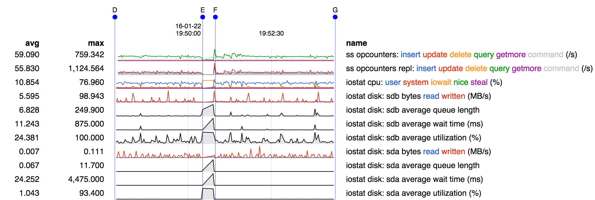
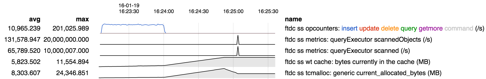
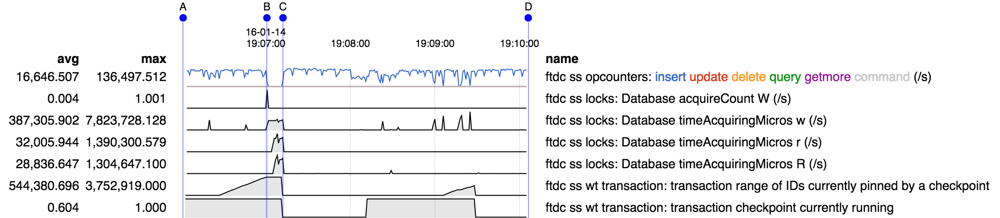
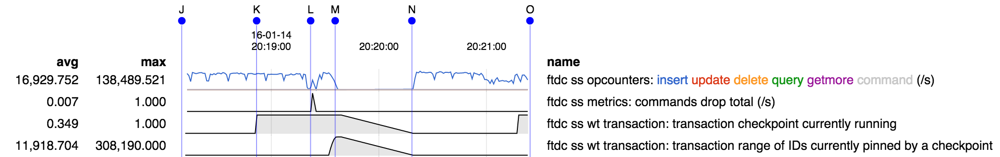

## Examples

* Around 19:50 UTC we see a complete stall in the opcounters, both
  replicated ops and secondary queries, marked by E-F.

* Coinciding with this we see high iowait CPU percentage, which means
  everything is stuck waiting for i/o completion.

* Both sdb and sda show a stall in data rates accompanied by long
  queues, high wait times, and high utilization. Since utilization
  measures the ratio between operating rate and capacity, and
  operating rate has dropped during this time, this means that
  effectively capacity has also dropped.

* All of the above point to an issue in the storage layer, which could
  be a problem in the kernel, in device controllers, or the devices
  themselves. Since it affects both sda and sdb, this points to
  something common between the two.

* Note the straight lines connecting the data points at E and F. This
  indicates that there were no data samples from E to F. This could be
  because execution in general was stalled, or it could be because the
  stall in operations led to a lock being held that blocked collection
  of serverStatus data.

* Initial period of high insert rate was setup for experiment.

* Then a query was run, and memory usage grew. During this time both
  WT cache usage (bytes currently in the cache) and total memory usage
  (current_allocated_bytes) grew. Peak memory usage (read from "max"
  column) is about 13 GB () in excess of WT cache.

* Query has scanned 20M documents (queryExecutor scannedObjects). Note
  that these are all accounted for at once at the end of the query, so
  we see an instanteous bump of 20M documents scanned in 1 second.

* This demonstrates an issue: very high (non-cache) memory utilization
  for this particular query.

* At B we see an operation acquring the db write lock ("Database
  acquireCount W" bumps by 1).

* Apparently that operation blocks because we see many threads queuing
  up behind it: for example, "Database timeAcquiringMicros w" per
  second was 7-8M, meaning 7-8 threads were queued up waiting for a
  database write intent lock, but were blocked, presumably by the
  thread that had acquired the database write lock. This resulted in a
  complete stall in this case because the app uses a single db.

* This has occurred during the final phase of a checkpoint, which is
  marked by "range of IDs currently pinned by a checkpoint" growing -
  during the final phase of a checkpoint the state that is being
  checkpointed must be pinned, pinning all transactions that occur
  after it.

* The stall ends at the end of a the checkpoint marked by C.

* Stack traces collected during the stall show that the blocked
  operation is a create collection. See
  [SERVER-22209](https://jira.mongodb.org/browse/SERVER-22209) for
  more detail, and see the [Tools](tools.md) page for details on
  collecting stack traces.

* Conclusion: create collection during the critical phase of a
  checkpoint can be blocked by the checkpoint, causing a complete
  stall. (Schedule for fix in 3.2.x).

* A checkpoint is running from K to N, as indicated by "transaction checkpoint currently running".

* A drop command is issued at L, as indicated by "commands drop total".

* This results in a complete stall from M to N. This is seen in the
  "insert" statistics. We can also tell by the straight line between
  the values at M and N that the ftdc thread was also stalled and
  could not collect any data samples.

* Stack traces collected during the stall show why: multiple
  operations are all stuck in dropAllQueued which in turn is blocked
  in __wt_session_drop. See
  [SERVER-22199](https://jira.mongodb.org/browse/SERVER-22199) for
  more detials, and see the [Tools](tools.md) page for details on
  collecting stack traces.

* Conclusion: drop collection during the critical phase of a
  checkpoint can be blocked by the checkpoint, causing a complete
  stall. (Schedule for fix in 3.2.x).

